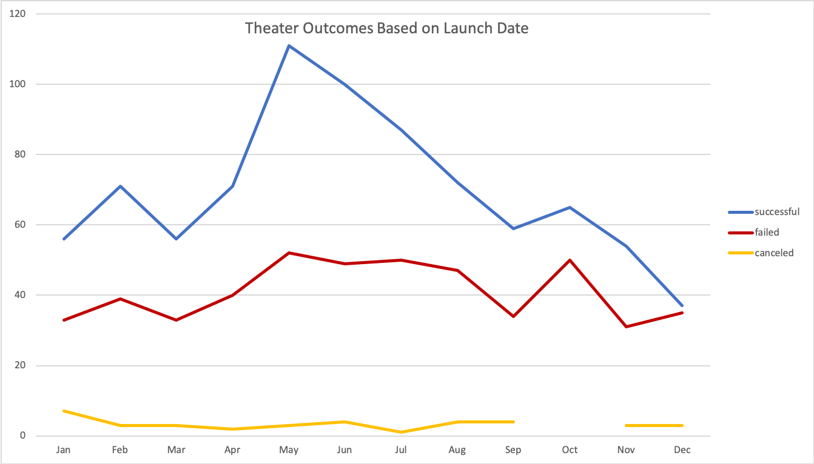

# **Analysis of Kickstarter Campaign Data to Identify Trends**
---
## **Overview of Project:**

The purpose of this analysis is to provide Louise information about the success of other plays based on their fundraising goals and launch date so that she can make informed decisions about when to launch or how to fundraise for future campaigns. 

## **Analysis and Challenges:**

I used Excel tools and formulas to analyze the Kickstarter data in two ways – to determine the most successful campaigns based on launch dates and based on fundraising goals. We used the Kickstarter file as it contains data for thousands of programs, including goal and pledged amounts, backers, and dates. In this analysis, we focused on the data provided for the theater category. 

I used the “Year” function in excel to categorize the Date Created Conversion by year. I then created a pivot table to provide better insight into the total successful, failed and canceled theater programs based on the month in which they were launched. I used “Parent Category” and “Years” as the filters for the table and filtered Parent Category for “Theater.” I then added “Date Created Conversion” in the rows field to separate the data by month. I added “Outcomes” in both the columns field and the values field to categorize the data by each type of outcome with the total number of shows per month. Using this Pivot Table, I added a Pivot Chart to visualize the outcomes by launch date each month. 

To analyze the outcomes by fundraising goal, I created a table based on the number of successful, failed or canceled plays within each fundraising goal range. I created the goal column to separate the fundraising amounts into $5,000 ranges, from less than $1,000 to greater than $50,000. I used the “COUNTIFS” function to determine the amount of successful, failed and canceled plays in each goal range. After finding the total in each range, I calculated the percentage successful, failed and canceled. I used this data to create a chart showing the ranges on the percentage of each outcome at each goal range. 

One of the challenges I faced during this analysis was during the “COUNTIFS” steps. I initially found it difficult to determine which data to use as the range or as the criteria. I watched the video in the example and compared the example to the data we were using, and what we wanted to show. I was able to write the formula using the necessary ranges (or columns) to show the number of outcomes in each fundraising range. Another challenge I encountered was the Outcomes_vs_Goals graph, where I was not sure how to show the specific data on each graph axis. I used “Select Data” in the Chart Design Toolbar and made the chart based on trial-and-error. Once I was able to get the correct data included on each axis, I changed the color of the lines.

## **Results:**

